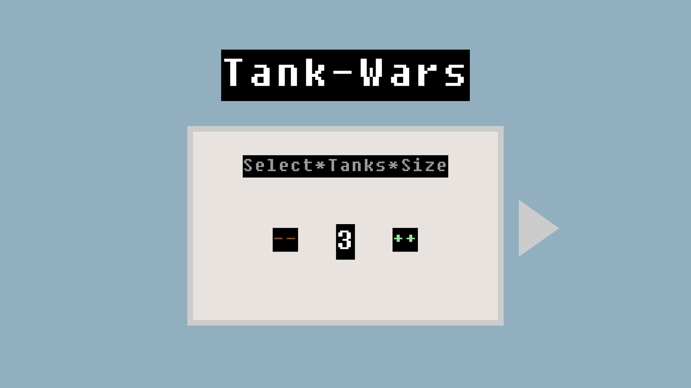
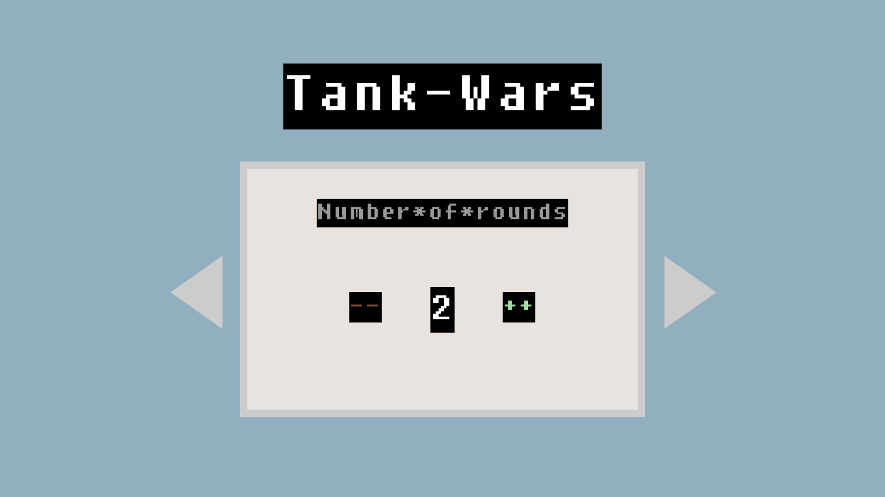
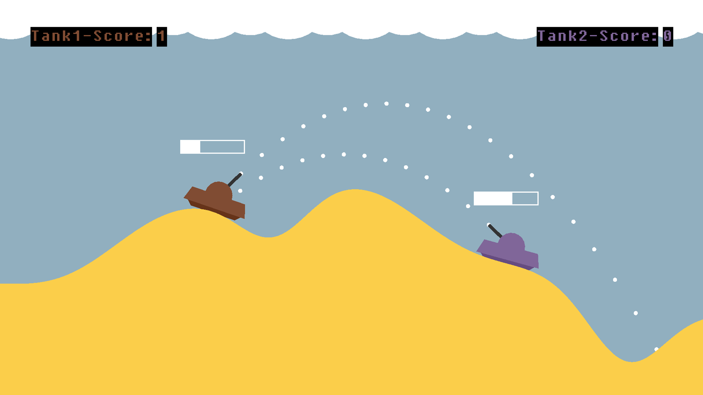

# Tank Wars Game

>This is a 2D tank combat game where two players control tanks on a destructible terrain, engaging in turn-based artillery combat. Players navigate the battlefield, aim their turrets, and fire projectiles to defeat their opponent across multiple rounds.

  
  

## **Table of contents**

1. [Introduction](#introduction)
    - [Game Overview](#game-overview)
    - [Key Features](#key-features)
    - [Supported Platforms](#supported-platforms)
2. [Prerequisites](#prerequisites)
    - [Install a compiler](#install-a-compiler)
    - [Install the third-party libraries](#install-the-third-party-libraries)
    - [Install the build tools](#install-the-build-tools)
3. [Building](#building)
4. [Running](#running)

## Introduction

**Tank Wars** is an engaging 2D artillery combat game where two players battle against each other using tanks positioned on a generated terrain. Built with OpenGL graphics programming, the game features physics-based projectile mechanics, destructible environments, and strategic gameplay that requires both precision and tactical thinking.

### **Game Overview**

In this combat simulation, two players control tanks equipped with rotating turrets, positioned on opposite sides of a generated mountainous terrain. The objective is straightforward yet challenging: aim your tank's turret and fire projectiles to hit your opponent while avoiding incoming fire. Each successful hit reduces the enemy tank's health, and the first player to eliminate their opponent wins the round. Victory is achieved by winning the majority of rounds in a match.

### **Key Features**

**Destructible Terrain System**: The battlefield features a dynamic terrain generated using mathematical functions that create realistic hills and valleys. When projectiles impact the ground, they create explosion craters that modify the landscape, opening new strategic possibilities and changing the battlefield dynamics throughout the match.

**Realistic Physics Engine**: Projectiles follow trajectories affected by gravity, requiring players to calculate angle and power for accurate shots. The physics system includes collision detection for both terrain and tank impacts, creating realistic bounce effects and explosion mechanics.

**Customizable Game Settings**: Before starting a match, players can configure tank size (1-5 scale) and the number of rounds (1-10) through an intuitive menu system. These settings allow for varied gameplay experiences, from quick battles to longer matches.

**Dynamic Terrain Animation**: The terrain features a landslide system that smooths out steep differences in height over time, creating a more realistic and visually appealing battlefield that evolves during gameplay.

**Visual Effects System**: The game includes camera shake effects during explosions, animated clouds that drift across the sky, and health bars that dynamically display each tank's remaining health above their position.

**Dual Control Scheme**: Tank 1 uses `WASD` keys for movement and turret, and `SPACE` key to fire, while Tank 2 uses arrow keys for movement and turret, and `ENTER` key to fire. This allows for comfortable simultaneous play on a single keyboard.

**Score Tracking and Round Management**: The game maintains persistent scoring across multiple rounds, displaying each player's wins and automatically managing round progression. When a tank is destroyed, the terrain regenerates and tanks respawn for the next round.

The game combines strategic thinking with skillful aiming, featuring smooth controls, detailed 2D graphics, and engaging gameplay mechanics that provide entertainment for players of all skill levels.

### Supported Platforms
The game is cross-platform, and supports the following architectures:

-   Windows: `i686`, `x86_64`, `arm64`
-   Linux: `i686`, `x86_64`, `arm64`
-   macOS: `x86_64`, `arm64`

## Prerequisites

This section describes ***what you need to do and install*** before actually building the code.

### Install a compiler

The compiler requirements are listed below. We strongly recommend to always use the latest compiler versions.

-   Minimum:
    -   Windows: Visual Studio 2015 Update 3 with `Programming Languages -> Visual C++` checked when installing
    -   Linux: `g++` version 5
    -   macOS: `clang++` version 4

-   Recommended:
    -   Windows: Visual Studio 2022 with `Workloads -> Desktop development with C++` checked when installing
        -    When installing Visual Studio 2019 or later, double-check that you selected "Desktop development with C++". This should download and install approximately 8 GB of stuff from the Microsoft servers. If you installed Visual Studio and it only took several minutes, you probably missed this step
    -   Linux: `g++` latest
    -   macOS: `clang++` latest, by doing one of the following:
        -   for LLVM/Clang: install [`brew`](https://brew.sh/) then run `brew install llvm`
        -   for Apple Clang: install XCode

### Install the third-party libraries

There are some open-source libraries that this game uses. To install them:

-   Windows: you don't need to do anything - all necessary libraries are already provided with the code

-   Linux: depending on your distribution, run one of the following scripts as superuser:
    -   Debian (Ubuntu): `./tools/deps-ubuntu.sh`
    -   Red Hat (Fedora): `./tools/deps-fedora.sh`
    -   Arch (x86_64): `./tools/deps-arch.sh`

-   macOS: install [`brew`](https://brew.sh/) then run `./tools/deps-macos.sh`

### Install the build tools

This project uses [CMake][ref-cmake]. In a nutshell, CMake does not compile source code, instead it creates files that you then use to compile your code (for example, it creates a Makefile on Linux and macOS, a Visual Studio project on Windows, and so on).

This project requires CMake ***3.16 or newer,*** however, it is recommended to use the latest version. To install it, follow these steps:

-   Windows:
    1.  go to the [CMake downloads page][ref-cmake-dl]
    2.  download the latest version of the file called `cmake-<VERSION>-windows-x86_64.msi`
    3.  install it

-   Linux:
    1.  use your package manager to install `cmake`
    2.  check the version using `cmake --version`
    3.  depending on the version:
        -   if it's the minimum required (see above), you're all set
        -   otherwise, run `./tools/install-cmake.sh && . ~/.profile` in a terminal

-   macOS:
    1.  run `brew install cmake`

After installation, run `cmake --version` to check that it's in your `PATH` environment variable. This should happen automatically, but if it didn't, just add it manually. Instructions on how to add an executable to your `PATH` differ across operating systems and are ***not*** covered here.

## Building

Open a terminal and go into the root folder of the project, which contains the top-level `CMakeLists.txt` file.
Do not run CMake directly from the top-level folder (meaning, do not do this: `cmake .`). Instead, make a separate directory, as follows:

1.  `mkdir build`
2.  `cd build`
3.  Generate the project:
    - `cmake ..`
4.  Build the project:
    -   Windows, one of the following:
        -   `cmake --build .`
        -   or just double-click the `.sln` file to open it in Visual Studio, then press `Ctrl+Shift+B` to build it
    -   Linux and macOS, one of the following:
        -   `cmake --build .`
        -   or just `make`

That's it!

***Note:*** When running the CMake generation step on Windows (meaning, `cmake ..`), you may receive errors that include the phrase `Permission denied`. If you currently have the framework on the `C:` drive, for example on the Desktop, you might not have write permissions. This could happen on single-drive devices (meaning, for example, computers with no disk partition other than `C:`). As an alternative, move the framework on the top-level (directly in `C:`) or create another drive partition (for example `D:`) and move it there.

## Running

You can run the game from an IDE, as well as standalone, from anywhere on disk. For example:

-   Windows, one of the following:
    -   `.\bin\Debug\TankWars`
    -   or just open the `.sln` file in Visual Studio, then press `F5` to run it

-   Linux and macOS:
    -   `./bin/Debug/TankWars`

**Have fun!**
